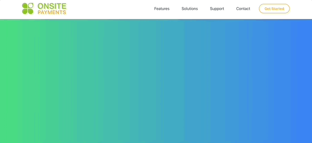

# 🌟 Onsite Payments 🌟  
**The official website for the Onsite Payments startup!**  

## 🚀 Project Overview  
**Onsite Payments** is the modern, responsive website designed to represent the startup and provide seamless payment management for businesses. This project focuses on delivering a clean user experience, scalable functionality, and a professional deployment strategy to establish the brand's online presence.

### My Contributions 🏗️  
- **🎨 UX Design**: Designed a clean and intuitive interface with a focus on accessibility and responsiveness.  
- **⚛️ Frontend Development**: Built using React.js and styled with CSS (using Tailwind CSS and Google Fonts) to deliver a fast, dynamic, and interactive user experience.  
- **🔧 Backend Integration**: Connected the app with [Getform.io](https://getform.io/) for secure and efficient form submissions.  
- **🌐 Deployment**: Deployed the app on **GoDaddy**, ensuring a reliable and professional live experience for users.  

## ✨ Features  
- **📋 Contact Form**:  
  - Fully validated form fields with real-time error handling.  
  - Supports Name, Subject, Email, Phone Number, and Message.  
  - Submissions are securely sent to the admin email using Getform.io.  
- **📱 Responsive Design**:  
  - Optimized for all screen sizes, from desktops to mobile devices.  
- **⚡ Fast and Smooth Deployment**:  
  - Deployed on GoDaddy for a reliable and professional online presence.  

## 🛠️ Technologies Used  
- **Frontend**: React.js ⚛️  
- **Styling**: CSS with Tailwind CSS and Google Fonts for a professional and polished design 🎨  
- **Backend Integration**: Getform.io for secure form handling 🛡️  
- **Deployment**: GoDaddy Hosting 🌐  

## 🌟 Key Highlights  
1. **Interactive UX**:  
   - Designed to guide users seamlessly through the contact form.  
   - Error handling ensures users fill in accurate and complete information.  

2. **Validated Contact Form**:  
   - Real-time validation for empty fields, invalid email formats, and numeric-only phone numbers. 

3. **Custom Branding**:  
   - Tab displays the “Onsite Payments” title and logo, reflecting the app's branding.  

## 🌐 Deployment  
The app is live! Check it out here: **[Onsite Payments](https://onsite-payments.com)** 🚀
